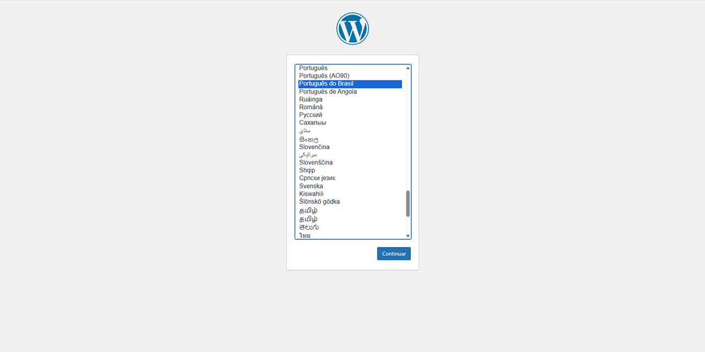
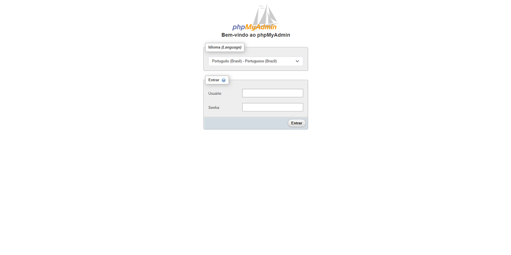

## **📝 Como Instalar WordPress Localmente com Docker de forma fácil e pratica.**

Esta documentação é um modelo pronto para criar, configurar e executar um ambiente local utilizando Docker e Docker Compose, para rodar o WordPress com MySQL e phpMyAdmin.

## 📦 Requerimentos
- Docker Desktop
- WordPress (via Docker Compose)
- phpMyAdmin 5.2.2 (via Docker)
- MySQL 8.0 (via Docker)
- Apache (imagem oficial do WordPress)
- Git para versionamento

## 🛠️ Como rodar localmente

Faça o download desse repositório em sua maquina local:

```bash
git clone https://github.com/seovictoroque/wp-docker.git
cd wp-docker
```

É necessário ter o Docker instalado. Faça o download, instale e reinicie o computador: <br><br>
[](https://www.docker.com/products/docker-desktop/)
[](https://docs.docker.com/engine/install/)
[](https://www.docker.com/products/docker-desktop/)


Suba o ambiente Docker:
```bash
docker-compose up -d
```

Acesse o WordPress no navegador através do endereço [`http://localhost:8000`](http://localhost:8000).


Para acessar o PhpMyAdmin, utilize o endereço [`http://localhost:8080`](http://localhost:8080).


## 📁 Estrutura do Projeto

```
www/
├── wp/
├── docker-compose.yml
├── composer.json (opcional)
```

Se tiver dificuldade para criar a imagem Docker, e preparar o ambiente de desenvolvimento wordpress local assista meu vídeo. Se ficar com alguma dúvida, deixe um comentário.

## 📌 Sugestões de Próximos passos

- [ ]  Desenvolver tema personalizado
- [ ]  Criar e testar plugins
- [ ]  Automatizar deploy com CI/CD

---

Feito com ❤️ por @seovictoroque
